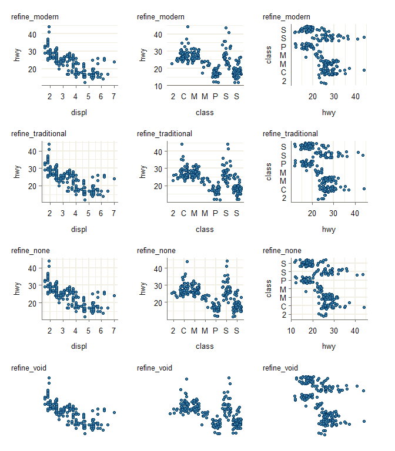

<!-- README.md is generated from README.Rmd. Please edit that file -->

# ggrefine <a href="https://davidhodge931.github.io/ggrefine/"></a>

<!-- badges: start -->

<!-- badges: end -->

The objective of ggrefine is to provide some pretty ggplot2 complete
themes, and refine functions to tweak these easily based on the
particulars of a plot.

## Installation

Install from CRAN, or development version from
[GitHub](https://github.com/).

``` r
install.packages("ggrefine") 
pak::pak("davidhodge931/ggrefine")
```

## Example

ggrefine provides a set of complete ggplot2 themes and functions to
refine these based on the particulars of the plot.

The themes use the inky [flexoki colours](https://stephango.com/flexoki)
developed by Steph Ango.

``` r
library(ggplot2)
library(ggrefine)
library(patchwork)

# Light themes use multiply for the border colour
p_light <- mpg |>
  ggplot(aes(x = hwy)) +
  geom_histogram(
    stat = "bin", shape = 21,
    colour = paletteblend::multiply("#357BA2FF")
  ) +
  scale_y_continuous(expand = expansion(mult = c(0, 0.05)))

# Dark theme uses screen for the border colour
p_dark <- mpg |>
  ggplot(aes(x = hwy)) +
  geom_histogram(
    stat = "bin", shape = 21,
    colour = paletteblend::screen("#357BA2FF")
  ) +
  scale_y_continuous(expand = expansion(mult = c(0, 0.05)))

p_white   <- p_light + theme_white()   + labs(title = "theme_white")
p_silver  <- p_light + theme_silver()  + labs(title = "theme_silver")
p_oat     <- p_light + theme_oat()     + labs(title = "theme_oat")
p_red     <- p_light + theme_red()     + labs(title = "theme_red")
p_orange  <- p_light + theme_orange()  + labs(title = "theme_orange")
p_yellow  <- p_light + theme_yellow()  + labs(title = "theme_yellow")
p_green   <- p_light + theme_green()   + labs(title = "theme_green")
p_cyan    <- p_light + theme_cyan()    + labs(title = "theme_cyan")
p_blue    <- p_light + theme_blue()    + labs(title = "theme_blue")
p_purple  <- p_light + theme_purple()  + labs(title = "theme_purple")
p_magenta <- p_light + theme_magenta() + labs(title = "theme_magenta")
p_black   <- p_dark  + theme_black()   + labs(title = "theme_black")
```

The main themes are `theme_white`, `theme_black`, `theme_oat` and
`theme_silver`.

``` r
wrap_plots(
  p_white,
  p_black,
  p_oat,
  p_silver
)
```


Some extras have been provided! These use the respective 50 shade from
the flexoki palette for the panel background, and then apply a multiply
blend of the colour with itself for the panel grid colour.

``` r
wrap_plots(
  p_red,
  p_orange,
  p_yellow,
  p_green,
  p_cyan,
  p_blue,
  p_purple,
  p_magenta
)
```


``` r
set_theme(new = theme_white())

p_continuous <- mpg |>
  ggplot(aes(x = displ, y = hwy)) +
  geom_point(shape = 21, colour = paletteblend::multiply("#357BA2FF"))

p_discrete_x <- mpg |>
  ggplot(aes(x = class, y = hwy)) +
  geom_jitter(shape = 21, colour = paletteblend::multiply("#357BA2FF")) +
  scale_x_discrete(labels = \(x) stringr::str_to_upper(stringr::str_sub(x, start = 1, 1)))

p_discrete_y <- mpg |>
  ggplot(aes(x = hwy, y = class)) +
  geom_jitter(shape = 21, colour = paletteblend::multiply("#357BA2FF")) +
  scale_y_discrete(labels = \(x) stringr::str_to_upper(stringr::str_sub(x, start = 1, 1)))

wrap_plots(
  p_continuous + refine_modern(x_type = "continuous", y_type = "continuous") + labs(title = "refine_modern"),
  p_discrete_x + refine_modern(x_type = "discrete",   y_type = "continuous") + labs(title = "refine_modern"),
  p_discrete_y + refine_modern(x_type = "continuous",  y_type = "discrete")  + labs(title = "refine_modern"),

  p_continuous + refine_traditional(x_type = "continuous", y_type = "continuous") + labs(title = "refine_traditional"),
  p_discrete_x + refine_traditional(x_type = "discrete",   y_type = "continuous") + labs(title = "refine_traditional"),
  p_discrete_y + refine_traditional(x_type = "continuous",  y_type = "discrete")  + labs(title = "refine_traditional"),

  p_continuous + refine_none(x_type = "continuous", y_type = "continuous") + labs(title = "refine_none"),
  p_discrete_x + refine_none(x_type = "discrete",   y_type = "continuous") + labs(title = "refine_none"),
  p_discrete_y + refine_none(x_type = "continuous",  y_type = "discrete")  + labs(title = "refine_none"),

  p_continuous + refine_void(x_type = "continuous", y_type = "continuous") + labs(title = "refine_void"),
  p_discrete_x + refine_void(x_type = "discrete",   y_type = "continuous") + labs(title = "refine_void"),
  p_discrete_y + refine_void(x_type = "continuous",  y_type = "discrete")  + labs(title = "refine_void"),

  ncol = 3
)
```


