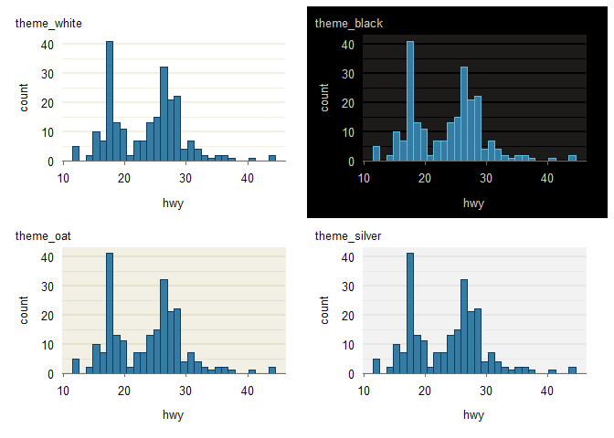
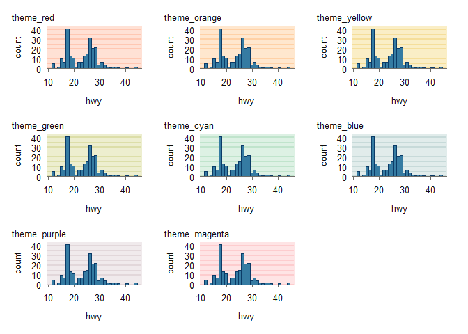
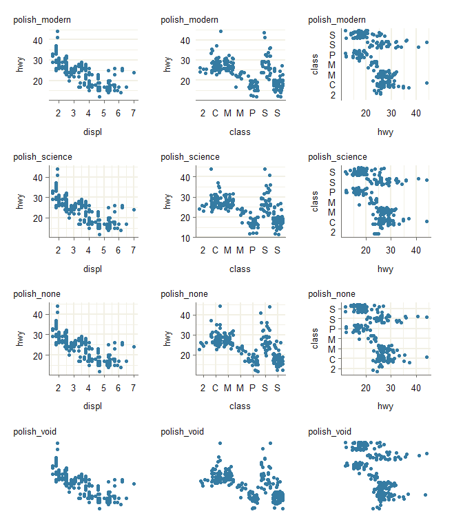

<!-- README.md is generated from README.Rmd. Please edit that file -->

# ggrefine <a href="https://davidhodge931.github.io/ggrefine/"></a>

<!-- badges: start -->

<!-- badges: end -->

The objective of ggrefine is to provide some pretty ggplot2 complete
themes, and polish functions to tweak these easily based on the
particulars of a plot.

## Installation

Install from CRAN, or development version from
[GitHub](https://github.com/).

``` r
install.packages("ggrefine") 
pak::pak("davidhodge931/ggrefine")
```

## Example

ggrefine provides a set of complete ggplot2 themes and theme polish
functions. Themes control the overall look, while polish functions let
you selectively remove gridlines, axis lines, and ticks based on the
focus and type of each axis. The themes use the inky flexoki colours
developed by Steph Ango.

``` r
library(ggplot2)
library(ggrefine)
library(patchwork)

# Light themes use multiply for the border colour
p_light <- mpg |>
  ggplot(aes(x = hwy)) +
  geom_histogram(
    stat = "bin", shape = 21,
    colour = paletteblend::multiply("#357BA2FF")
  ) +
  scale_y_continuous(expand = expansion(mult = c(0, 0.05)))

# Dark theme uses screen for the border colour
p_dark <- mpg |>
  ggplot(aes(x = hwy)) +
  geom_histogram(
    stat = "bin", shape = 21,
    colour = paletteblend::screen("#357BA2FF")
  ) +
  scale_y_continuous(expand = expansion(mult = c(0, 0.05)))

p_white   <- p_light + theme_white()   + polish_modern() + labs(title = "theme_white")
p_silver  <- p_light + theme_silver()  + polish_modern() + labs(title = "theme_silver")
p_oat     <- p_light + theme_oat()     + polish_modern() + labs(title = "theme_oat")
p_red     <- p_light + theme_red()     + polish_modern() + labs(title = "theme_red")
p_orange  <- p_light + theme_orange()  + polish_modern() + labs(title = "theme_orange")
p_yellow  <- p_light + theme_yellow()  + polish_modern() + labs(title = "theme_yellow")
p_green   <- p_light + theme_green()   + polish_modern() + labs(title = "theme_green")
p_cyan    <- p_light + theme_cyan()    + polish_modern() + labs(title = "theme_cyan")
p_blue    <- p_light + theme_blue()    + polish_modern() + labs(title = "theme_blue")
p_purple  <- p_light + theme_purple()  + polish_modern() + labs(title = "theme_purple")
p_magenta <- p_light + theme_magenta() + polish_modern() + labs(title = "theme_magenta")
p_black   <- p_dark  + theme_black()   + polish_modern() + labs(title = "theme_black")
```

``` r
wrap_plots(
  p_white,
  p_black,
  p_oat,
  p_silver
)
#> `stat_bin()` using `bins = 30`. Pick better value `binwidth`.
#> `stat_bin()` using `bins = 30`. Pick better value `binwidth`.
#> `stat_bin()` using `bins = 30`. Pick better value `binwidth`.
#> `stat_bin()` using `bins = 30`. Pick better value `binwidth`.
```



``` r
wrap_plots(
  p_red,
  p_orange,
  p_yellow,
  p_green,
  p_cyan,
  p_blue,
  p_purple,
  p_magenta
)
#> `stat_bin()` using `bins = 30`. Pick better value `binwidth`.
#> `stat_bin()` using `bins = 30`. Pick better value `binwidth`.
#> `stat_bin()` using `bins = 30`. Pick better value `binwidth`.
#> `stat_bin()` using `bins = 30`. Pick better value `binwidth`.
#> `stat_bin()` using `bins = 30`. Pick better value `binwidth`.
#> `stat_bin()` using `bins = 30`. Pick better value `binwidth`.
#> `stat_bin()` using `bins = 30`. Pick better value `binwidth`.
#> `stat_bin()` using `bins = 30`. Pick better value `binwidth`.
```



``` r
set_theme(new = theme_white())

p_continuous <- mpg |>
  ggplot(aes(x = displ, y = hwy)) +
  geom_point(shape = 21) 

p_discrete_x <- mpg |>
  ggplot(aes(x = class, y = hwy)) +
  geom_jitter(shape = 21) +
  scale_x_discrete(labels = \(x) stringr::str_to_upper(stringr::str_sub(x, start = 1, 1))) 

p_discrete_y <- mpg |>
  ggplot(aes(x = hwy, y = class)) +
  geom_jitter(shape = 21) +
  scale_y_discrete(labels = \(x) stringr::str_to_upper(stringr::str_sub(x, start = 1, 1)))

wrap_plots(
  p_continuous + polish_modern(focus = "x", x_type = "continuous", y_type = "continuous") + labs(title = "polish_modern"),
  p_discrete_x + polish_modern(focus = "x", x_type = "discrete",   y_type = "continuous") + labs(title = "polish_modern"),
  p_discrete_y + polish_modern(focus = "y", x_type = "continuous",  y_type = "discrete")  + labs(title = "polish_modern"),
  
  p_continuous + polish_science(focus = "x", x_type = "continuous", y_type = "continuous") + labs(title = "polish_science"),
  p_discrete_x + polish_science(focus = "x", x_type = "discrete",   y_type = "continuous") + labs(title = "polish_science"),
  p_discrete_y + polish_science(focus = "y", x_type = "continuous",  y_type = "discrete")  + labs(title = "polish_science"),
  
  p_continuous + polish_none(focus = "x", x_type = "continuous", y_type = "continuous") + labs(title = "polish_none"),
  p_discrete_x + polish_none(focus = "x", x_type = "discrete",   y_type = "continuous") + labs(title = "polish_none"),
  p_discrete_y + polish_none(focus = "y", x_type = "continuous",  y_type = "discrete")  + labs(title = "polish_none"),
  
  p_continuous + polish_void(focus = "x", x_type = "continuous", y_type = "continuous") + labs(title = "polish_void"),
  p_discrete_x + polish_void(focus = "x", x_type = "discrete",   y_type = "continuous") + labs(title = "polish_void"),
  p_discrete_y + polish_void(focus = "y", x_type = "continuous",  y_type = "discrete")  + labs(title = "polish_void"),
  
  ncol = 3
)
```


