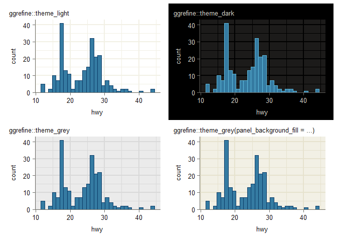

<!-- README.md is generated from README.Rmd. Please edit that file -->

# ggrefine <a href="https://davidhodge931.github.io/ggrefine/"></a>

<!-- badges: start -->

[](https://CRAN.R-project.org/package=ggrefine)
<!-- badges: end -->

The objective of ggrefine is to provide some pretty ggplot2 complete
themes, and refine functions to tweak these easily based on the
particulars of a plot.

## Installation

Install from CRAN, or development version from
[GitHub](https://github.com/).

``` r
install.packages("ggrefine") 
pak::pak("davidhodge931/ggrefine")
```

## Theme

The themes are built to work with the refine functions - and can be
customised easily.

The `theme_grey` function differs from the other two in that the
`panel_grid_colour` by default is derived by applying a multiply blend
on the `panel_background_fill`.

To avoid namespace collisions, it is recommended to not load the
package, but instead refer to each function with the package name
(e.g. `ggrefine::theme_grey()`.

``` r
library(ggplot2)

p_base_light <- mpg |>
  ggplot(aes(x = hwy)) +
  geom_histogram(
    stat = "bin", shape = 21,
    colour = blends::multiply("#357BA2FF")
  ) +
  scale_y_continuous(expand = expansion(mult = c(0, 0.05)))

p_base_dark <- mpg |>
  ggplot(aes(x = hwy)) +
  geom_histogram(
    stat = "bin", shape = 21,
    colour = blends::screen("#357BA2FF")
  ) +
  scale_y_continuous(expand = expansion(mult = c(0, 0.05)))

p_light  <- p_base_light + ggrefine::theme_light() + labs(title = "ggrefine::theme_light")
p_dark  <- p_base_dark  + ggrefine::theme_dark() + labs(title = "ggrefine::theme_dark")
p_grey <- p_base_light + ggrefine::theme_grey() + labs(title = "ggrefine::theme_grey")
p_oat <- p_base_light + ggrefine::theme_grey(
  panel_background_fill = flexoki::flexoki$base["base50"],)  +
  labs(title = "ggrefine::theme_grey(panel_background_fill = ...)")

patchwork::wrap_plots(
  p_light,
  p_dark,
  p_grey,
  p_oat
)
```



## Refine

The other functions adjust gridlines and axis elements based on axis
types (`x_type` and `y_type`), which default to `"continuous"`.

``` r
set_theme(new = ggrefine::theme_grey())

p_continuous <- mpg |>
  ggplot(aes(x = displ, y = hwy)) +
  geom_point(shape = 21, colour = blends::multiply("#357BA2FF"))

p_discrete_x <- mpg |>
  ggplot(aes(x = drv, y = hwy)) +
  geom_jitter(shape = 21, colour = blends::multiply("#357BA2FF")) 

p_discrete_y <- mpg |>
  ggplot(aes(x = hwy, y = drv)) +
  geom_jitter(shape = 21, colour = blends::multiply("#357BA2FF")) 

patchwork::wrap_plots(
  p_continuous + ggrefine::modern() + labs(title = "ggrefine::modern"),
  p_discrete_x + ggrefine::modern(x_type = "discrete"),
  p_discrete_y + ggrefine::modern(y_type = "discrete"),
  p_continuous + ggrefine::classic() + labs(title = "ggrefine::classic"),
  p_discrete_x + ggrefine::classic(x_type = "discrete"),
  p_discrete_y + ggrefine::classic(y_type = "discrete"),
  p_continuous + ggrefine::hybrid() + labs(title = "ggrefine::hybrid"),
  p_discrete_x + ggrefine::hybrid(x_type = "discrete"),
  p_discrete_y + ggrefine::hybrid(y_type = "discrete"),
  p_continuous + ggrefine::void() + labs(title = "ggrefine::void"),
  p_discrete_x + ggrefine::void(x_type = "discrete"),
  p_discrete_y + ggrefine::void(y_type = "discrete"),
  p_continuous + ggrefine::none() + labs(title = "ggrefine::none"),
  p_discrete_x + ggrefine::none(x_type = "discrete"),
  p_discrete_y + ggrefine::none(y_type = "discrete"),
  ncol = 3
)
```


