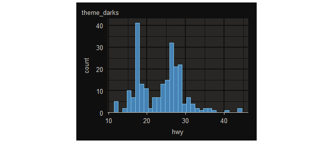
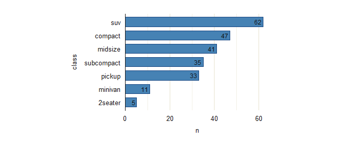
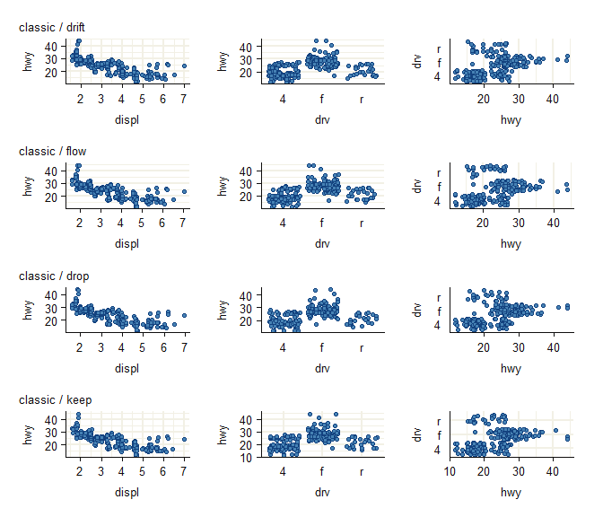
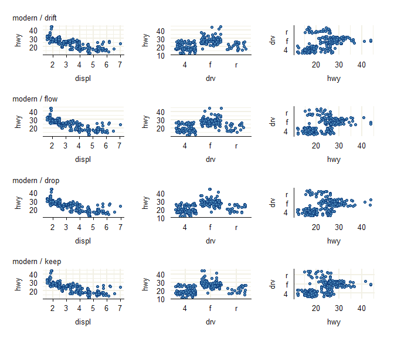
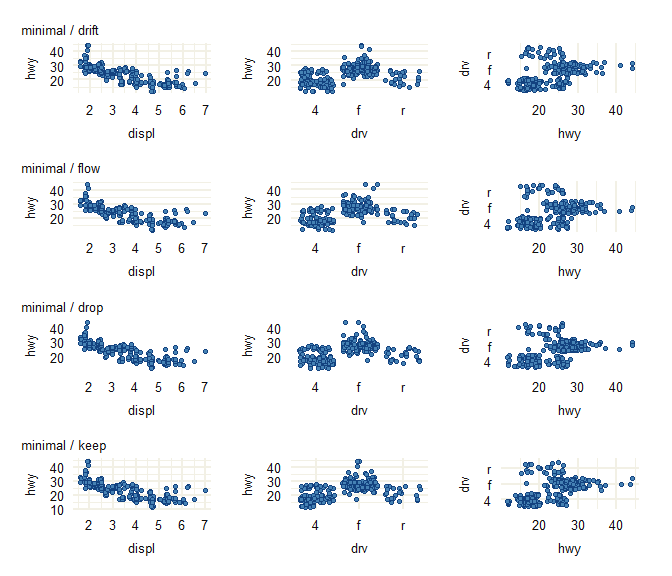
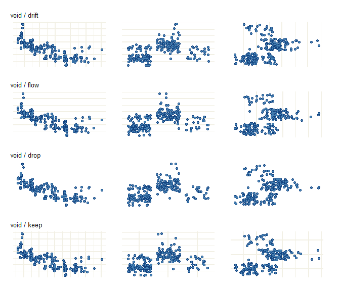

<!-- README.md is generated from README.Rmd. Please edit that file -->

# ggrefine <a href="https://davidhodge931.github.io/ggrefine/"></a>

<!-- badges: start -->

[](https://CRAN.R-project.org/package=ggrefine)
<!-- badges: end -->

The objective of ggrefine is to provide complete themes for
publication-quality ‘ggplot2’ visualisation. Functions are provided to
modify these based on the positional axis scales and orientation of a
particular plot.

## Installation

Install from CRAN, or development version from
[GitHub](https://github.com/).

``` r
install.packages("ggrefine") 
pak::pak("davidhodge931/ggrefine")
```

## Theme

The themes are built to work with the refine functions in that they have
all axis and panel grid elements.

They can also be customised easily.

The `theme_ggplot2` function has a smart `panel_grid_colour` default
that is derived from the `panel_background_fill`.

``` r
library(ggplot2)
library(patchwork)
library(ggrefine)

set_theme(theme_lights())

update_panel_size(heights = unit(5, "cm"), widths = unit(7.5, "cm"))

p <- mpg |>
  ggrefine() +
  aes(x = hwy) +
  geom_histogram(
    stat = "bin", 
  ) +
  scale_y_zero() + 
  scale_fill_blend_discrete() +
  refine_modern_flow(discrete = "none")

p + labs(title = "theme_lights")
#> `stat_bin()` using `bins = 30`. Pick better value `binwidth`.
```


``` r
update_greys()
p + labs(title = "theme_greys") 
#> `stat_bin()` using `bins = 30`. Pick better value `binwidth`.
```


``` r
update_darks()
p + labs(title = "theme_darks")
#> `stat_bin()` using `bins = 30`. Pick better value `binwidth`.
```



``` r

update_lights()
update_panel_size(heights = NULL, widths = NULL)
```

## Scales and Aesthetics

The package provides dynamic color and fill aesthetic and scale helpers
that evaluate aesthetics late to provide automatic colour or fill
properties. It features blend scales (scale\_blend) to automatically
compute complementary outline or fill, as well as contrast helpers
(aes_fill_contrast(discrete = “none”) and aes_panel_contrast(discrete =
“none”)) to adaptively select light or dark colours based on the fill or
set panel background.

It is recommended to use the ggrefine function, followed by
ggplot2::aes, and change the colour/fill or palettes using
update_palette. This ensures these functions will work in all
situations.

``` r
update_palette(discrete = jumble::jumble)

penguins |>
  tidyr::drop_na() |>
  dplyr::count(species, sex) |>
  ggrefine() +
  aes(x = sex, y = n, fill = species, label = n) +
  geom_col(width = 0.5, position = position_dodge2()) +
  scale_y_zero(name = NULL, labels = NULL) + 
  scale_fill_blend_discrete(name = NULL) +
  geom_text(
    aes_fill_contrast(discrete = "none"), 
    position = position_dodge2(width = 0.5), 
    vjust = 1.33,
  ) +
  refine_modern_flow(discrete = "x") +
  refine_legend(place = "top")
```



``` r

update_palette(discrete = scales::pal_hue())
```

## Refine

A series of refine functions are provided.

The premise is that it is useful to set themes that have all axis and
panel grid elements - and then adjust depending on the positional axis
scales and orientation of a particular plot.

The refine functions are organised and named by:

- axis: `*_classic_*`, `*_modern_*`, `*_minimal_*`, and `*_void_*`.
- panel grid: `*_drift`, `*_flow`, `*_drop`, `*_keep`.

These functions then remove or not particular axis and panel grid
components for different positional scales (and the intended orientation
of the plot).

Note scales can also be used to remove the relevant `axis.title` and
`axis.text`.

``` r
p_discrete_none <- mpg |>
  ggrefine() +
  aes(x = displ, y = hwy) +
  geom_jitter() +
  scale_fill_blend_discrete()

p_discrete_x <- mpg |>
  ggrefine() +
  aes(x = drv, y = hwy) +
  geom_jitter() +
  scale_fill_blend_discrete()

p_discrete_y <- mpg |>
  ggrefine() +
  aes(x = hwy, y = drv) +
  geom_jitter() +
  scale_fill_blend_discrete()
```

``` r
patchwork::wrap_plots(
  p_discrete_none + refine_classic_drift(discrete = "none") + labs(title = "refine_classic_drift"),
  p_discrete_x + refine_classic_drift(discrete = "x"),
  p_discrete_y + refine_classic_drift(discrete = "y"),

  p_discrete_none + refine_classic_flow(discrete = "none") + labs(title = "refine_classic_flow"),
  p_discrete_x + refine_classic_flow(discrete = "x"),
  p_discrete_y + refine_classic_flow(discrete = "y"),

  p_discrete_none + refine_classic_drop(discrete = "none") + labs(title = "refine_classic_drop"),
  p_discrete_x + refine_classic_drop(discrete = "x"),
  p_discrete_y + refine_classic_drop(discrete = "y"),
  
  p_discrete_none + refine_classic_keep(discrete = "none") + labs(title = "refine_classic_keep"),
  p_discrete_x + refine_classic_keep(discrete = "x"),
  p_discrete_y + refine_classic_keep(discrete = "y"),

  ncol = 3
)
```



``` r
patchwork::wrap_plots(
  p_discrete_none + refine_modern_drift(discrete = "none") + labs(title = "refine_modern_drift"),
  p_discrete_x + refine_modern_drift(discrete = "x"),
  p_discrete_y + refine_modern_drift(discrete = "y"),

  p_discrete_none + refine_modern_flow(discrete = "none") + labs(title = "refine_modern_flow"),
  p_discrete_x + refine_modern_flow(discrete = "x"),
  p_discrete_y + refine_modern_flow(discrete = "y"),

  p_discrete_none + refine_modern_drop(discrete = "none") + labs(title = "refine_modern_drop"),
  p_discrete_x + refine_modern_drop(discrete = "x"),
  p_discrete_y + refine_modern_drop(discrete = "y"),

  p_discrete_none + refine_modern_keep(discrete = "none") + labs(title = "refine_modern_keep"),
  p_discrete_x + refine_modern_keep(discrete = "x"),
  p_discrete_y + refine_modern_keep(discrete = "y"),

  ncol = 3
)
```



``` r
patchwork::wrap_plots(
  p_discrete_none + refine_minimal_drift(discrete = "none") + labs(title = "refine_minimal_drift"),
  p_discrete_x + refine_minimal_drift(discrete = "x"),
  p_discrete_y + refine_minimal_drift(discrete = "y"),

  p_discrete_none + refine_minimal_flow(discrete = "none") + labs(title = "refine_minimal_flow"),
  p_discrete_x + refine_minimal_flow(discrete = "x"),
  p_discrete_y + refine_minimal_flow(discrete = "y"),

  p_discrete_none + refine_minimal_drop(discrete = "none") + labs(title = "refine_minimal_drop"),
  p_discrete_x + refine_minimal_drop(discrete = "x"),
  p_discrete_y + refine_minimal_drop(discrete = "y"),
  
  p_discrete_none + refine_minimal_keep(discrete = "none") + labs(title = "refine_minimal_keep"),
  p_discrete_x + refine_minimal_keep(discrete = "x"),
  p_discrete_y + refine_minimal_keep(discrete = "y"),

  ncol = 3
)
```



``` r
patchwork::wrap_plots(
  p_discrete_none + refine_void_drift(discrete = "none") + labs(title = "refine_void_drift"),
  p_discrete_x + refine_void_drift(discrete = "x"),
  p_discrete_y + refine_void_drift(discrete = "y"),

  p_discrete_none + refine_void_flow(discrete = "none") + labs(title = "refine_void_flow"),
  p_discrete_x + refine_void_flow(discrete = "x"),
  p_discrete_y + refine_void_flow(discrete = "y"),

  p_discrete_none + refine_void_drop(discrete = "none") + labs(title = "refine_void_drop"),
  p_discrete_x + refine_void_drop(discrete = "x"),
  p_discrete_y + refine_void_drop(discrete = "y"),
  
  p_discrete_none + refine_void_keep(discrete = "none") + labs(title = "refine_void_keep"),
  p_discrete_x + refine_void_keep(discrete = "x"),
  p_discrete_y + refine_void_keep(discrete = "y"),

  ncol = 3
)
```



## Other packages

This package is part of a group of related packages built to extend
[ggplot2](https://ggplot2.tidyverse.org).

<table>

<tr>

<td align="center">

<a href="https://davidhodge931.github.io/ggblanket/"></a>
</td>

<td align="center">

<a href="https://davidhodge931.github.io/ggrefine/"></a>
</td>

<td align="center">

<a href="https://davidhodge931.github.io/ggscribe/"></a>
</td>

<td align="center">

<a href="https://davidhodge931.github.io/ggwidth/"></a>
</td>

<td align="center">

<a href="https://davidhodge931.github.io/blends/"></a>
</td>

<td align="center">

<a href="https://davidhodge931.github.io/jumble/"></a>
</td>

</tr>

</table>
