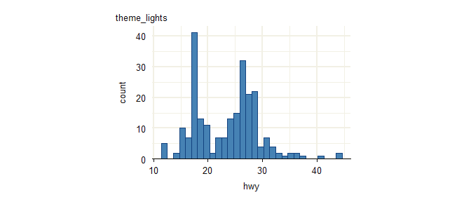
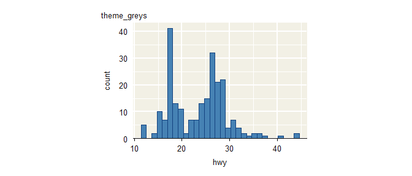
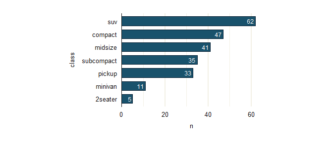
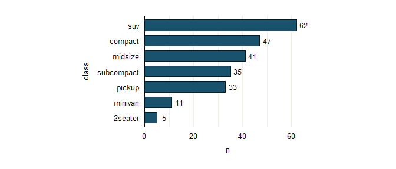
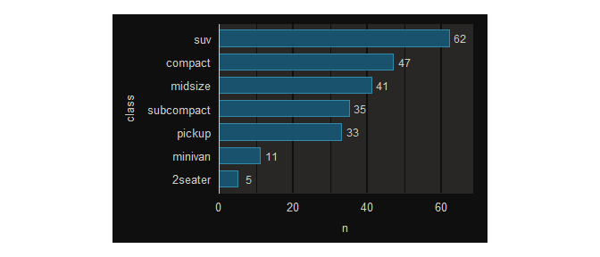

# ggrefine

The objective of ggrefine is to provide complete themes for
publication-quality ‘ggplot2’ visualisation. Functions are provided to
modify these based on the positional axis scales and orientation of a
particular plot.

## Installation

Install from CRAN, or development version from
[GitHub](https://github.com/).

``` r

install.packages("ggrefine") 
pak::pak("davidhodge931/ggrefine")
```

## Theme

The themes are built to work with the refine functions in that they have
all axis and panel grid elements.

They can also be customised easily.

The `theme_ggplot2` function has a smart `panel_grid_colour` default
that is derived from the `panel_background_fill`.

``` r

library(ggplot2)
library(ggrefine)

set_theme(theme_lights())
update_panel_size(heights = unit(5, "cm"), widths = unit(7.5, "cm"))

p <- mpg |>
  ggplot() +
  aes(x = hwy) +
  geom_histogram(
    stat = "bin", 
  ) +
  scale_y_zero() + 
  scale_fill_colourblend_discrete() +
  refine_axis_grid(discrete = "none")

p + labs(title = "theme_lights")
#> `stat_bin()` using `bins = 30`. Pick better value `binwidth`.
```



``` r

update_greys()
p + labs(title = "theme_greys") 
#> `stat_bin()` using `bins = 30`. Pick better value `binwidth`.
```



``` r

update_darks()
p + labs(title = "theme_darks")
#> `stat_bin()` using `bins = 30`. Pick better value `binwidth`.
```


``` r

update_lights()
```

## Scales and Aesthetics

The package provides dynamic color and fill aesthetic and scale helpers
that evaluate aesthetics late to provide automatic colour or fill
properties.

These can be:

- a blend of fill (or colour)
- a contrast of fill (intended for text geoms)
- a contrast of the panel.background fill (intended for text geoms).

Note `aes_colourcontrast` requires the `ggrefine` function to be used
instead of
[`ggplot2::ggplot`](https://ggplot2.tidyverse.org/reference/ggplot.html)
to work where no fill aesthetic is mapped. As such, it can be useful to
always use ggrefine followed by
[`ggplot2::aes`](https://ggplot2.tidyverse.org/reference/aes.html) to
avoid thinking about this.

``` r

penguins |>
  ggrefine() +
  aes(x = flipper_len, y = body_mass, fill = species) +
  geom_point() +
  scale_fill_colourblend_discrete() +
  refine_axis_grid(discrete = "none")
#> Warning: Removed 2 rows containing missing values or values outside the scale range
#> (`geom_point()`).
```


``` r


p <- mpg |>
  dplyr::count(class) |>
  dplyr::mutate(class = forcats::fct_reorder(class, n)) |>
  ggrefine() + 
  aes(x = n, y = class, label = n) +
  geom_col(width = 0.7) +
  scale_x_zero() +
  scale_fill_colourblend_discrete() + 
  refine_axis_grid(discrete = "y")

p +
  geom_text(aes_colourcontrast(), hjust = 1.25)
```


``` r


update_palette(fixed = jumble::navy)

p +
  geom_text(aes_colourcontrast(), hjust = 1.25) 
```



``` r


update_palette(discrete = jumble::jumble)

p +
  aes(fill = class) +
  geom_text(aes_colourcontrast(), hjust = 1.25) +
  refine_legend(position = "top") 
```


``` r

  
p +
  geom_text(aes(x = n + (max(n) * 0.05), !!!aes_colourpanel()))
```



``` r


update_darks()

p +
  geom_text(aes(x = n + (max(n) * 0.05), !!!aes_colourpanel()))
```



## Other packages

This package is part of a group of related packages built to extend
[ggplot2](https://ggplot2.tidyverse.org).

|  |  |  |  |  |  |
|:--:|:--:|:--:|:--:|:--:|:--:|
| [](https://davidhodge931.github.io/ggblanket/) | [](https://davidhodge931.github.io/ggrefine/) | [](https://davidhodge931.github.io/ggscribe/) | [](https://davidhodge931.github.io/ggwidth/) | [](https://davidhodge931.github.io/blends/) | [](https://davidhodge931.github.io/jumble/) |
